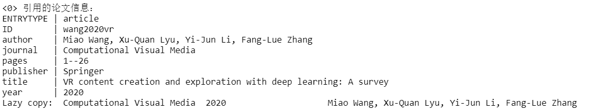

# A Jupiter notebook of spider

## Description

**A simple spider for gather the information of  cited papers from google scholar**



## Requirements

```shell
Windows  == 10
Python   == 3.7
Language == Zh_CN
JupyterLab
```

More depending packages , please refer to `requirements.txt`

## Step-by-step tutorial

1. Open the `chrome`
2. Visit Google Scholar
3. Search the keyword of your paper
4. Get the list of papers that cited your paper
5. Summary all the information of the paper list.